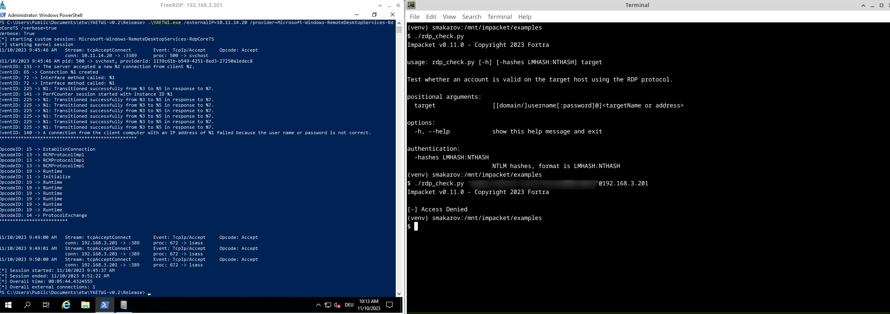
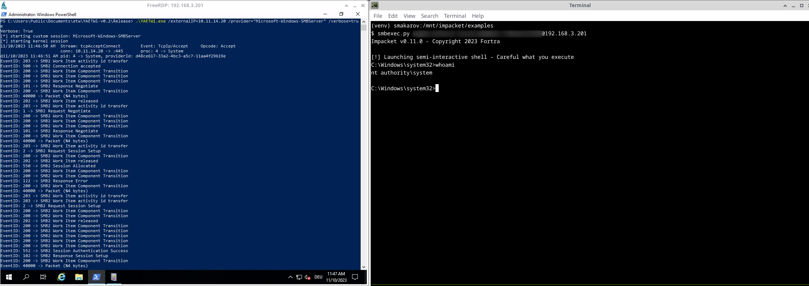

# YAETWi

Yet Another ETW implementation;

YAETWix (supportive tool) -> see description below;

### Description
Imagine, you're writing your own detection rules based on the Windows log events.\
YAETWi allows you to trace a particular process based on its PID (-> YAETWix) or based on the connections from a particular IP address providing a deep tracing based on implementation of the ETW interface. 

### Examples
- Tracing impacket/rdp_check.py execution from Kali VM:

- Tracing impacket/smbexec.py execution from Kali VM:


### MAN pages
```
Usage:
         YAETWi.exe
                /externalIP=<IP> | /pids=<comma-separated list of pids to be traced>
                [/kernel]

Keystrokes:
         'd' -> (dump) all traced providers
         'r' -> (read) provider name to print detailed output for
         'w' -> (write) output of particular provider down to a file
         'c' -> (clear) all events
         'p' -> manually provide comma-separated pids to be traced -> all collections and pids will be purged; (!) list is not immune to pids discovered through 'externalIP' parameter afterwards
         'h' -> show (help) menu
```

### Changelog
* v2.2.0 
  * provides capability to trace multiple PIDs
* v2.3.1
  * data source has been changed to a dynamic one providing capabilities for event/payload parsing
* v2.4.0
  * provides an option to write an output down to file
  * all commits from now on are signed with a key 745FB4B5625BE79B68E39AA5F6E89A9718CB6CCD
* v2.7.1
  * removed verbose parameter
  * provides an option to write down into a user-specified directory
  * on dump shows timestamps of events for triggered providers
# YAETWix

### Description
YAETWix is a helper tool, which puts any process into suspended mode, obtains its PID, which in turn can be provided to YAETWi as an argument, and continues its execution, after you're ready.

### MAN pages
```
Usage:
        .\YAETWix.exe <"full_path_to_binary + arguments">
Example:
        .\YAETWix.exe "c:\windows\system32\cmd.exe /c whoami"
Kestrokes:
        r -> resume process
```
